***Cloud Computing (Lab 4)***

***Name : Sarosh Majeed***

***Reg no : 2023-BSE-059***

***Task 1 – Verify VM resources in VMware***

***Confirm the VM resources that were allocated in Lab 1.***

***Open VMware
Workstation and locate the Ubuntu Server VM you used in Lab 1. Inspect
VM settings and note the following (no commands required for GUI): VM
name, RAM, CPU, disk, and network adapter type. Take a screenshot of the
VM settings window showing RAM, CPU, disk and networking.***

***Task
2 – Start VM and log in (use your preferred host terminal method
only)***

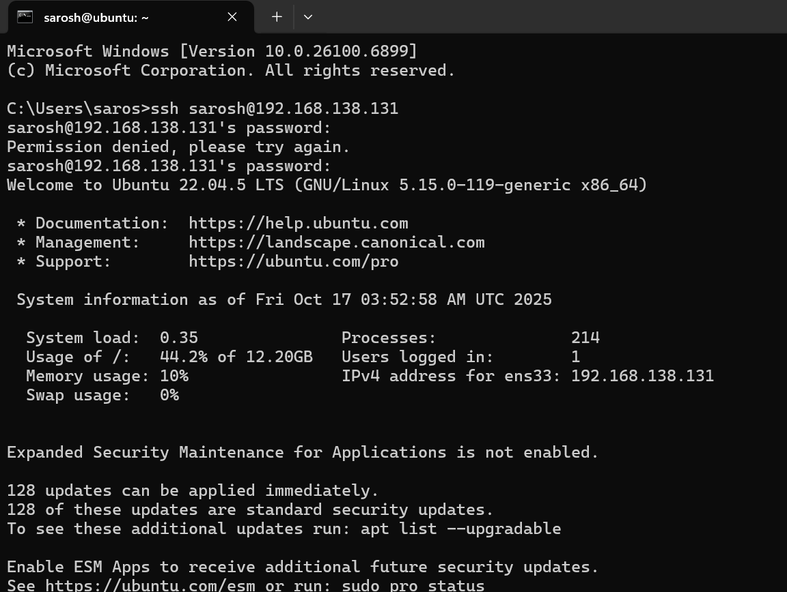

***Use a single preferred host-terminal method to connect to the VM. Do
not switch between methods during the task. Start (or resume) the VM in
VMware Workstation on your host.***

***From your host, open your preferred terminal (for example: Windows
Command Prompt, PowerShell, macOS Terminal, or Linux Terminal) and
connect to the VM using SSH. Example:***

***ssh
student@\<vm-ip-address\>***

***Task 3 – Filesystem exploration — root tree and
dotfiles***

***Explore Linux filesystem layout and hidden files. Capture outputs
using screenshots only (do not create text files). For the short
explanation required in this task, write the paragraph in an editor and
capture it as a screenshot (answers_md.png) — do not supply the .md
file.***

***Steps (run inside VM terminal)***

***List root directory contents:***

***ls -la /***

***View OS release information:***

***cat /etc/os-release***

***Inspect these directories (run each command and screenshot the
output):***

***ls -la /bin***

***ls -la /sbin***

***ls -la
/usr***

***ls -la /opt***

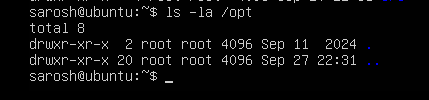

***ls -la /etc***

***ls -la /dev***

***ls -la /var***

***ls -la /tmp***

***List your home directory and show hidden (dot) files:***

***ls -la ~***

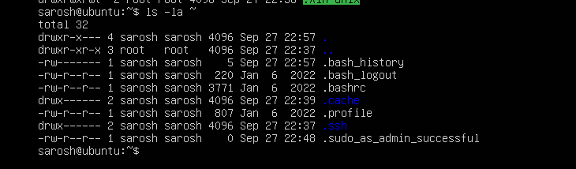

***Write a short paragraph (3–5 sentences) that explains the difference
between /bin, /usr/bin and /usr/local/bin. Open your editor:***

***nano ~/answers.md***

***Type the paragraph in the editor, save and exit.***

***After saving, open the editor display (or show the file) and capture
a screenshot of the paragraph.***

***Reminder:
Do not upload the .md file—submit the screenshot answers_md.png as proof
of your written answer.***

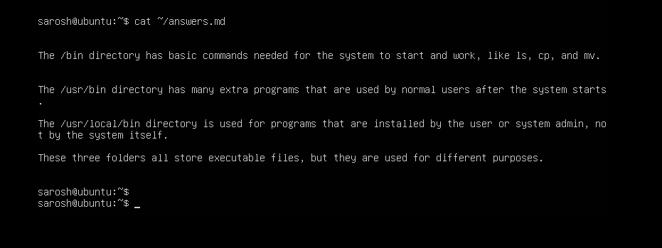

***Task 4 – Essential CLI tasks — navigation and file
operations***

***Steps (inside VM terminal)***

***Create a workspace and navigate:***

***mkdir
-p ~/lab4/workspace/python_project***

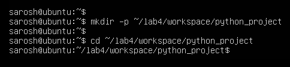

***cd ~/lab4/workspace/python_project***

***pwd***

***Create files using an editor (open each editor session and save a
screenshot showing content):***

***nano README.md and Inside nano add: Lab 4 README and save.***

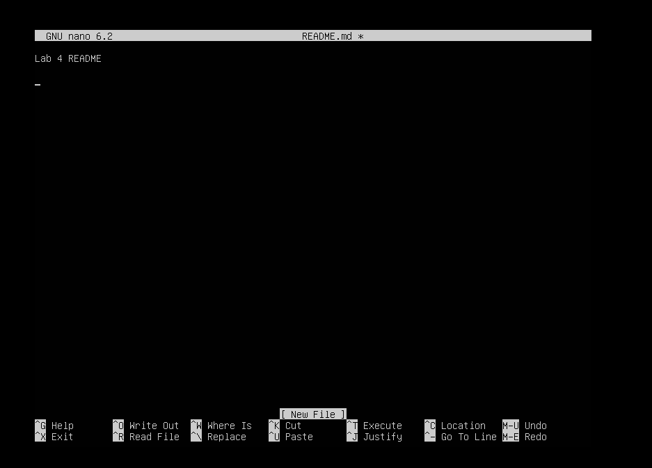

***nano main.py and Inside nano add: print("hello lab4") and save.***

***nano
.env and Inside nano add: ENV=lab4 and save.***

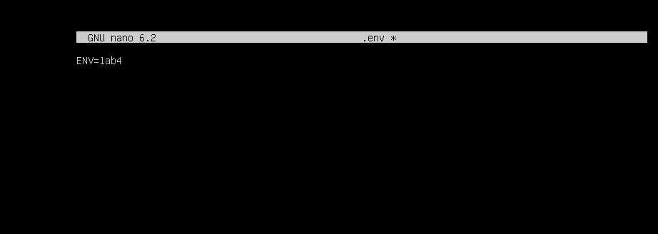

***List files and capture:***

***ls
-la***

***Copy, move and remove: cp README.md README.copy.md and mv
README.copy.md and README.dev.md***

***mkdir -p ~/lab4/workspace/java_app***

***cp -r ~/lab4/workspace/python_project
~/lab4/workspace/java_app_copy***

***ls -la ~/lab4/workspace***

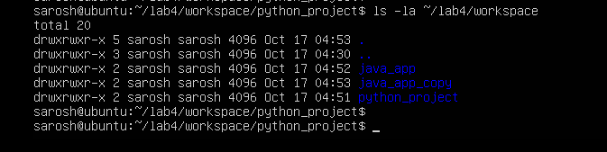

***Use command history and tab completion:***

***history***

***tab_completion***

***Task 5 – System info, resources &
processes***

***Steps (inside VM terminal)***

***Kernel and OS: uname -a***

***CPU
(ensure model name visible): cat /proc/cpuinfo***

***Memory: free -h***

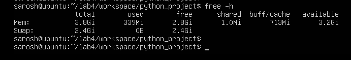

***Disk: df -h***

***Os Release: cat /etc/os-release***

***Processes
(show top lines of ps output): ps aux***

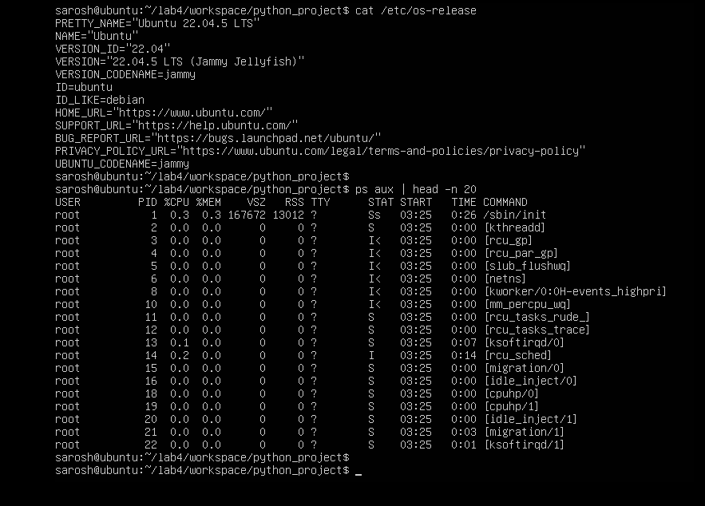

***Task 6 – Users and account verification (no sudo
group change)***

***Create a non‑root user and verify the account exists. This task does
NOT add the created user to the sudo group.***

***Steps (inside VM terminal)***

***Create a new user named lab4user: sudo adduser lab4user***

***Verify the user entry: getent passwd lab4user***

***Verification (Optional)***

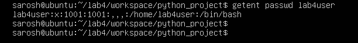

***Switch
to the new user to verify login: su - lab4user***

***From the new user you may attempt a sudo command to show that sudo is
not available for this account (expected failure), e.g.: sudo whoami***

***Return to the original user:***

***exit***

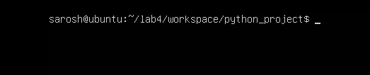