                              Cloud Computing (Lab 6
                                                   6)

Name : Sarosh Majeed

Reg no : 2023-BSE-059

Task 1 – Switch to root with su - and back to a normal user Goal:
Demonstrate switching to the root account using su - and exiting back to
your normal user.

Set a root password (Ubuntu root is disabled by default; this enables
su - temporarily for the lab):

sudo passwd root

# Enter a temporary root password for the lab

Switch to root and verify:

su - whoami id

Switch back to your normal user: exit whoami

Task 2 – Create user tom and verify in passwd/group/shadow Goal: Create
a user named tom, then verify the account in system files files.

Create user tom (interactive, sets password and home directory): sudo
adduser tom Verify tom in system files (view and visually confirm
presence): cat /etc/passwd

cat /etc/group

sudo cat /etc/shadow

Notes: /etc/shadow stores password hashes (not plaintext). You must use
sudo to read it.

Task 3 – Create groups; change tom’s primary and secondary groups Goal:
Create groups developer, devops, and designer. Change tom’s primary
group and manage secondary groups.

Create groups and verify by viewing /etc/group (visually confirm entries
exist):

sudo groupadd developer

sudo groupadd devops

sudo groupadd designer

cat /etc/group

Change tom’s primary group to designer and verify:

sudo usermod -g designer tom

id tom

Add secondary groups developer and devops to tom and verify:

sudo usermod -aG aG developer,devops tom

id tom

groups tom

Replace all secondary groups so only tom (user’s own group) remains and
verify:

sudo usermod -G tom tom

id tom

groups tom Task 4 – Create/delete users (Jerry, Scooby) and groups
(jolly, anime) Goal: Create users using both adduser and useradd,
demonstrate login/password/home directory differences, then delete
users/groups.

Create users: sudo adduser Jerry sudo useradd Scooby

Try to log in as Scooby immediately (expected authentication failure
because there is no password yet): su – Scooby

Set a password for Scooby: sudo passwd Scooby

Try logging in as Scooby again (home directory still missing; expect a
message such as “No directory, direc logging in with HOME=/”): su -
Scooby

Show that Scooby’s home directory does not exist yet and what
/etc/passwd says:

exit

cat /etc/passwd ls -ld /home/Scooby

Manually create Scooby’s home directory and set proper ownership and
permissions:

sudo mkdir -p /home/Scooby

sudo chown Scooby:Scooby /home/Scooby

sudo chmod 750 /home/Scooby

ls -ld /home/Scooby

Log in as Scooby again and verify you land in the correct home
directory:

su - Scooby

pwd

ls -la

Verify users in system files and observe shell of Scooby: exit cat
/etc/passwd Change the shell from /bin/sh to /bin/bash

sudo usermod -ss /bin/bash Scooby

su - Scooby

Create groups:

sudo addgroup jolly

sudo groupadd anime

Verify groups: cat /etc/group Delete groups and users:

sudo delgroup jolly

sudo groupdel anime

cat /etc/group

sudo deluser –remove-home home Jerry

sudo userdel -r Scooby

cat /etc/passwd

Task 5 – Create user Student; create files; set owner/group; identify
file types Create Student: sudo adduser Student

Switch to Student and create files:

su - Student

touch file1

mkdir -p dir1

touch dir1/file2

ls –l

Change owner then group for file1 (separate commands):

sudo chown tom file1

ls -l file1

sudo chgrp devops file1

ls -l file1 Identify files/directories and show /dev/null:

ls -l

ls -l dir1

ls -l /dev/null

file file1 dir1 /dev/null

Exit Student: exit

Task 6 – Change permissions using symbolic mode Target file: ~/file1
(run these as the Student user)

Ensure Student and file present:

su - Student

cd ~

ls -l file1

Remove all permissions:

chmod -rwx file1 ls -l file1

Add read to all:

chmod +r file1

ls -l file1

Add execute to user:

chmod u+x file1

ls -l file1

Add write to user and group:

chmod ug+w file1

ls -l file1

Remove all permissions (explicit):

chmod ugo-rwx file1

ls -l file1

Task 7 – Change permissions using “set” symbolic form (u= g= o=) Ensure
you are Student: su - Student

cd ~

ls -l file1

Set all to rwx:

chmod u=rwx,g=rwx,o=rwx file1

ls -l file1

Remove execute from group and others:

chmod g=rw,o=rw file1

ls -l file1

Remove all permissions:

chmod u=,g=,o= file1

ls -l file1

Task 8 – Change permissions using numeric (octal) mode Ensure you are
Student: su - Student

cd ~

ls -l file1

Run each command and capture pture screenshot after each ls:

chmod 777 file1

ls -l file1

chmod 700 file1

ls -l file1

chmod 744 file1

ls -l file1

chmod 640 file1

ls -l file1

chmod 664 file1

ls -l file1 chmod 775 file1

ls -l file1

chmod 750 file1

ls -l file1

Task 9 – Practice pipes, pagers, grep, and redirects with
/var/log/syslog less:

sudo cat /var/log/syslog \| less

# quit q \#arrow keys to move

more: sudo cat /var/log/syslog \| more

# quit q \#spacebar to move

grep failures/errors: sudo grep -EE ‘fail\|error’ /var/log/syslog \|
head

# E enables extended regex \# head shows only the first 10 result

redirect: sudo grep -ii systemd /var/log/syslog \> ~/syslog_systemd.txt

# \> creates or overwrites the file.

append: sudo grep -ii network /var/log/syslog \>\> ~/syslog_systemd.txt

cat ~/syslog_systemd.txt

# \>\> appends (adds at the end without deleting old

Alternative (journalctl) if needed:

sudo journalctl \| less

sudo journalctl -u systemd \| grep –i error \> ~/journal_errors.txt

Task 10 – Script setup.sh – variables, command substitution, file/dir
checks, permissions (use vim) Goal: Using vim, write a script named
setup.sh that implements each numbered step below. After writing the
code for each step, run the script and capture screenshots showing the
vim editor (script content) and the script output for that step.
Students must add the code for each step into the same file setup.sh
step-by-step step (i.e., write 1., save, run and screenshot; then append
2., save, run and screenshot; and so on).

For each step you MUST:

Open vim and edit setup.sh

Insert only the code shown for that ste step (append to the existing
file)

Save and quit vim (:wq)

Make the file executable if not already: chmod +x setup.sh

Run the script: ./setup.sh

Capture two screenshots: One showing the vim editor with the script
content after you added the step (use the vim screen before :wq)

One showing the terminal output after running the script (show the
command and the output)

Start in your Student home directory (recommended).

------------------------------------------------------------------------

Include bash shebang

Code to add (enter in vim as the first line of the file):

\#!/bin/bash

Steps:

vim setup.sh → add the shebang line → save and quit

chmod +x setup.sh

./setup.sh

script run output (likely no output but show ./setup.sh run)

Define variable var1 and echo it

Code to append: # Define and show var1

var1=“Hello from Lab 6”

echo “var1: \$var1”

Steps:

vim setup.sh → append the code above → save and quit

./setup.sh

Save output of ls -ll into variable allFiles and echo it

Code to append:

# Save ls -l to variable and display

allFiles=“\$(ls -l)”

echo “allFiles (ls -l):”

echo “\$allFiles”

Steps:

vim setup.sh → append the code above → save and quit ./setup.sh

If directory dir1 exists echo a message; else create it

Code to append:

# Directory check

if \[ -d “dir1” \]; then

echo “Directory dir1 exists.”

else

echo “Directory dir1 does not exist. Creating…”

mkdir -p “dir1”

echo “Directory dir1 created.”

fi

Steps:

vim setup.sh → append the code above → save and quit

./setup.sh script run output showing directory message or creation If
file dir1/file2 does not exist, create it

Code to append:

# File check

if \[ -f “dir1/file2” \]; then

echo “file2 already exists.”

else

echo “file2 does not exist. Creating…”

touch “dir1/file2”

chmod a-rwx “dir1/file2”

echo “file2 created.”

fi

Steps:

vim setup.sh → append the code above → save and quit

./setup.sh script run output showing file creation message or existence
Check read, write, execute permissions on dir1/file2; grant missing user
perms and show final ls

Code to append:

# Permission checks for dir1/file2 (user permissions)

f=“dir1/file2”

if \[ ! -r “\$f” \]; then

echo “Read permission missing; granting to user…”

chmod u+r “\$f”

fi

if \[ ! -w “\$f” \]; then

echo “Write permission missing; granting to user…”

chmod u+w “\$f”

fi

if \[ ! -x “\$f” \]; then

echo “Execute permission missing; granting to user…”

chmod u+x “\$f”

fi

echo “Final permissions for \$f:”

ls -l “\$f”

Steps:

vim setup.sh → append the code above → save and quit

./setup.sh script run output showing the permission grants and final ls
-l dir1/file2 Important notes for Task 10:

Students MUST add the code incrementally exactly as described above (do
not replace the file each time — append).

Capture the vim editor screen (showing your code in the buffer) before
you save and quit for each step (these are the task10_b\*\_vim.png
files).

After saving, aving, run the script and capture the terminal output for
that run (these are the task10_b\*\_run.png files).

If a step reports that a directory/file already exists, that is
acceptable — still capture the output screenshot showing the script’s
message.

Task 11 – Script setup.sh – argument comparisons (eq, ne, gt, lt, ge,
le) and string checks Updated: replace the previous single single-script
approach with an incremental exercise. Students will overwrite setup.sh
and then add each individual if if-test one-by-one. one. After adding
each if-test if they must run the script with example arguments and
capture screenshots. This teaches the individual comparison operators
and makes each if sstatement a separate step.

Important overall instructions

Start by overwriting setup.sh (vim setup.sh) and add only what the step
asks (do not add all tests at once).

After editing in vim, save (:wq), make executable (chmod +x setup.sh) if
needed, then run the script sc with the example commands shown for each
step. For each step capture two screenshots:

A vim screenshot showing the current file buffer with the newly added
lines (before :wq) — name as specified for the step.

A terminal screenshot showing the commands you ran (chmod +x setup.sh if
necessary) and the script outputs for the example invocations — name as
specified for the step.

For the numeric comparisons, set a variable num=\$1 at the top of the
file before adding the individual if-tests (this will be the initial
step). For string checks, set str=\$2 before adding the string if-tests.
if

create file with shebang and set num and str variables

In vim create/overwrite setup.sh and insert:

\#!/bin/bash

num=\$1

str=\$2

Save and quit (:wq)

Make executable and run with examples:

chmod +x setup.sh

./setup.sh 10 Student

add the -eq test (equal)

Append to setup.sh:

if \[ “\$num” -eq 10 \]; then

echo “\$num is equal to 10 (-eq).”

else

echo “\$num is NOT equal to 10 (-eq).” eq).”

fi Save and quit; then run these commands (capture both in one terminal
screenshot):

./setup.sh 10 Student

./setup.sh 7 Student

add the -ne test (not equal)

Append to setup.sh:

if \[ “\$num” -ne 10 \]; then

echo “\$num is not equal to 10 (-ne).” ne).”

else

echo “\$num is equal to 10 (-ne ne false).”

fi

Save and quit; run:

./setup.sh 7 Student

./setup.sh 10 Student add the -gt test (greater than)

Append:

if \[ “\$num” -gt 10 \]; then

echo “\$num is greater than 10 (-gt).” gt).”

else

echo “\$num is NOT greater than 10 ((-gt).”

fi

Run:

./setup.sh 12 Student

./setup.sh 9 Student

add the -lt test (less than)

Append:

if \[ “\$num” -lt 10 \]; then

echo “\$num is less than 10 (-lt).” else

echo “\$num is NOT less than 10 (–lt).”

fi

Run:

./setup.sh 5 Student

./setup.sh 11 Student

add the -ge ge test (greater than or equal)

Append:

if \[ “\$num” -ge 10 \]; then

echo “\$num is greater than or equal to 10 ((-ge).”

else

echo “\$num is NOT greater than or equal to 10 ((-ge).”

fi

Run:

./setup.sh 10 Student ./setup.sh 8 Student

add the -le le test (less than or equal)

Append:

if \[ “\$num” -le 10 \]; then

echo “\$num is less than or equal to 10 ((-le).”

else

echo “\$num is NOT less than or equal to 10 ((-le).”

fi

Run:

./setup.sh 10 Student

./setup.sh 12 Student string equality test ( = )

Ensure str=\$2 exists at top (1.). Append:

if \[ “\$str” = “Student” \]; then

echo “Second argument equals ‘Student’ ( = ).”

else

echo “Second argument does NOT equal ‘Student’ ( = ).”

fi

Run:

./setup.sh 10 Student

./setup.sh 10 Test

string inequality test ( != )

Append:

if \[ “\$str” != “Student” \]; then

echo “Second argument is not equal to ‘Student’ ( != ).”

else

echo “Second argument equals ‘Student’ ( != false).”

fi

Run:

./setup.sh 10 Test

./setup.sh 10 Student check if second argument rgument is empty (zero
(zero-length)

Append:

if \[ -z “\$str” \]; then

echo “Second argument is empty (zero (zero-length).”

else

echo “Second argument is not empty.”

fi

Run:

./setup.sh 10

./setup.sh 10 Student Important Note Task 11 :

Students MUST follow the incremental approach: add one test at a time
and capture the vim buffer and run output screenshots for each step.

Using the two example runs per step in a single terminal screenshot
helps demonstrate both true and false results for the operator being
ttaught.

If a non-numeric numeric value is used for \$1 during integer
comparisons the shell may print an error; that is expected here because
we are demonstrating the operator behavior step step-by-step. step. (If
you want to avoid runtime errors, you can add integer validatio
validation before the comparisons — but for this exercise we are
isolating each if-test test into its own step.)

Task 12 – Script setup.sh – print all arguments with a for loop Create
the script with shebang and basic structure

Open vim and overwrite setup.sh:

vim setup.sh

Insert these lines (first step — shebang and a short comment):

\#!/bin/bash

# Script to demonstrate printing all user

                                     user-entered arguments using $*

Save and quit (:wq)

Append the for loop using \$\* and print each argument

Re-open setup.sh in vim and append the following lines:

# Print all arguments using \$\*

echo “Printing all arguments using \$\*:”

for arg in \$\*; do

echo “Argument: \$arg” done

Save and quit (:wq)

Make the script executable and run it with example arguments:

chmod +x setup.sh

./setup.sh one “two words” three

Task 13 – Script setup.sh – while loop summation and functions Clear the
previous code of setup.sh and write a new script, step-by-step, that:

Starts with a shebang line

Implements an interactive while loop that prompts tthe he user to enter
numbers and keeps a running total until the user types q to quit; after
each input the script echoes “Total Score: <current_total>”

Implements a function sum_two() that runs its own interactive while loop
doing the same accumulation and echoes the running totals

Adds a second function that takes two numeric arguments, sums them, and
returns the result via echo (demonstrated in the script)

Important: if you move the while-loop loop logic into the sum_two()
function, delete the standalone while- while loop code to avoid running
the same loop twice

Add the shebang line

Open vim and overwrite setup.sh with the shebang line: #!/bin/bash

Save and quit (:wq)

Make executable and run (no output expected):

chmod +x setup.sh

./setup.sh

Add the while-loop summation (interactive)

Re-open open setup.sh in vim and append the while while-loop:

# While-loop

        loop summation (interactive)

sum=0

while true; do

read -p p “Enter a number (or ‘q’ to quit):” input

if \[ “\$input” = “q” \]; then

break

fi

sum=\$((sum + input))

echo “Total Score: \$sum”

done

echo “Final total: \$sum”

Save and quit (:wq)

Run the script and demonstrate a short session (example): enter 5, then
7, then q ./setup.sh

# interactively enter:

\#5

\#7

\#q

Add the interactive summation function and demonstrate it

Re-open open setup.sh in vim and append the function sum_two() which
contains its own interactive while- while loop:

# Function to accumulate scores interactively

sum_two() {

sum=0

while true; do

read -p p “Enter a number (or ‘q’ to quit):” input

if \[ “\$input” = “q” \]; then

     break

fi

sum=\$((sum + input))  echo “Total Score: \$sum”

    done

    echo "Function final total: $sum"

}

# Demonstrate the function

echo “Now calling sum_two function:”

sum_two

Save and quit (:wq)

Important: If you have the standalone while while-loop loop from step 2
and you place this function into the script, delete the standalone loop
to avoid executing the same interactive logic twice when running the
script.

Run the script and demonstrate a short session (example): enter 3, 4, q
when prompted by the function:

./setup.sh

# when prompted by the function enter:

\#3

\#4

\#q Add a function that takes two numeric arguments, sums them, and
returns the result (echo)

Re-open open setup.sh in vim and append the following function and
demonstration. This function accepts two numeric arguments, adds them,
and return the sum. The script then captures that output and displays
it.

# Function that sums two arguments and returns th

                                               the result

sum_args() {

    a=$1

    b=$2

    return $((a + b))

}

# Demonstrate sum_args function

echo “Now demonstrating sum_args function:”

sum_args 3 4

result=\$?

echo “sum_args(3,4) returned: \$result”

Save and quit (:wq)

Run the script and capture the demonstration output:

chmod +x setup.sh

./setup.sh

# Observe the output that shows “sum_args(3,4) returned: 7”

Notes for Task 13:

Overwrite previous contents of setup.sh at the start of Task 13 (step
1).

Add code incrementally, save, run, and capture both the vim buffer and
the run output screenshots for each numbered step.

The while-loop and the functions are interactive; include the user
inputs in the run screenshots to demonstrate the behavior.

If you decide to use the function-based approach for interactive
summation, remove the earlier standalone while-loop to avoid duplicate
interaction.

Task 14 – Codespaces GUI — fork repo, run start-desktop.sh, open VNC,
stop GUI Goal: Fork the specified repository to your GitHub account,
open it in GitHub Codespaces, run the provided script to start a desktop
GUI, connect to the GUI via the Codespaces forwarded port (6080) -\>
vnc.html, and then stop the GUI using the provided stop script.

Important notes before starting:

GitHub Codespaces must be enabled for your account/org. Codespaces
availability and billing may apply.

The instructions below assume you have permission and capacity to create
a Codespace for your fork.

If Codespaces is not available, you may perform this step on another
cloud environment that exposes the same port and scripts, but the
screenshot filenames below assume Codespaces.

Steps:

Fork the repository to your GitHub account

Open the repo URL in your browser:

Ubuntu Machine

Click “Fork” (top-right) and fork it to your account. Open a Codespace
on your fork

In your forked repository on GitHub, click the green “Code” button →
“Open with Codespaces” → “Create codespace on main”” (or appropriate
branch).

Wait for the Codespace to initialize.

Verify the start script is present and executable (capture evidence)

In the Codespace terminal list files in the repo root and show the start
sscript cript and stop script exist:

ls -l start-desktop.sh stop-desktop.sh desktop.sh If not executable,
make it executable:

chmod +x start-desktop.sh stop-desktop.sh desktop.sh

Save a screenshot showing the ls -ll output (file listing) and the chmod
command if applied:

Run the start script inside the Codespace terminal

In the Codespace terminal run:

# Ensure the start script is executable

chmod +x start-desktop.sh

# Start the desktop GUI

./start-desktop.sh

Capture the terminal output showing successful start messages.

Verify forwarded ports in Codespaces (Ports view)

Open the Codespaces “Ports” panel / view and confirm port 6080 is
forwarded and visible. Save a screenshot shot of the Ports view showing
port 6080 and its status:

Open forwarded port 6080 and connect to VNC HTML page

In the Codespaces UI, open the forwarded port’s preview URL or copy the
forwarded URL and open it in your browser.

Visit thee port 6080 address and click the vnc.html link.

When prompted for a password enter:

codespace

Capture screenshots of:

The browser showing the forwarded port URL in the address bar / Codesp
Codespacess preview

The VNC password prompt (showing p password assword field; do NOT
include typed password in a screenshot): task14_vnc_password_prompt.png

The VNC session after successful connection showing the GUI/desktop:
task14_vnc_desktop.png

(Optional) A focused screenshot of vnc.html UI showing the “Connect” b
button utton before/after connecting: task14_vnc_connect.png Stop the
GUI

When finished, return to the Codespace terminal and run:

./stop-desktop.sh

Capture the terminal output that shows the GUI stopping and any cleanup
messages.

Troubleshooting tips:

If port 6080 is not visible, check Codespaces “Ports” view and forward
it manually.

If the VNC page fails to connect, verify the start start-desktop.sh
desktop.sh completed without errors and that the VNC server is listening
on the expected port insi inside the Codespace.

If Codespaces is unavailable for your account, consider forking and
running the same scripts on another cloud VM that forwards port 6080 and
adapt screenshots/file names accordingly.

------------------------------------------------------------------------



---

### Extracted images

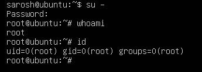
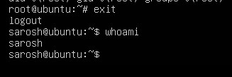

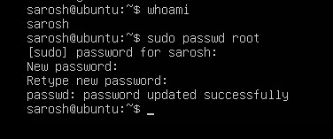

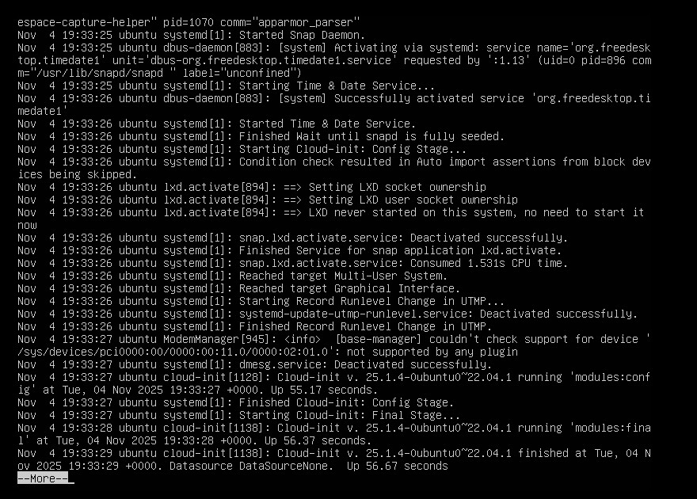

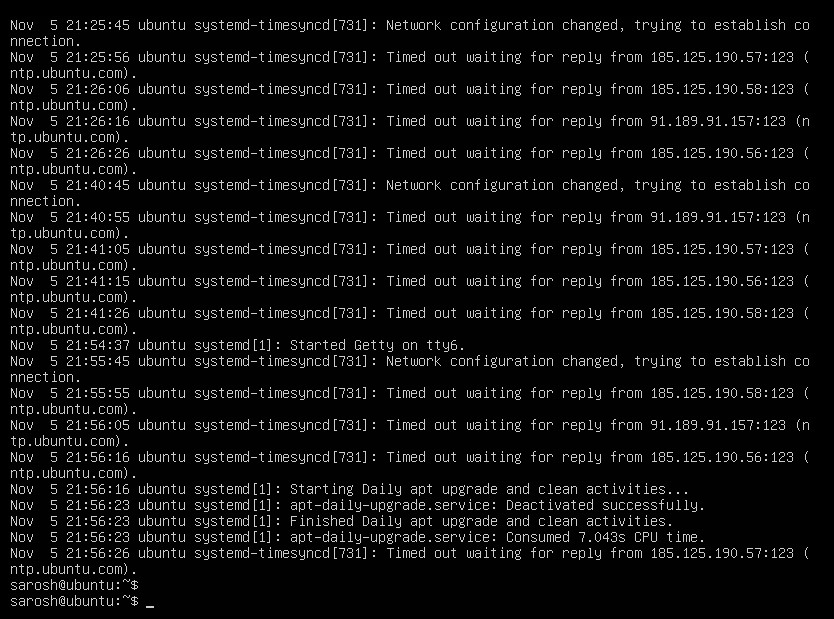

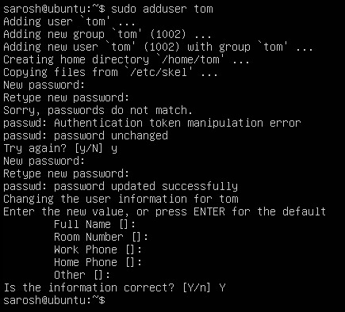

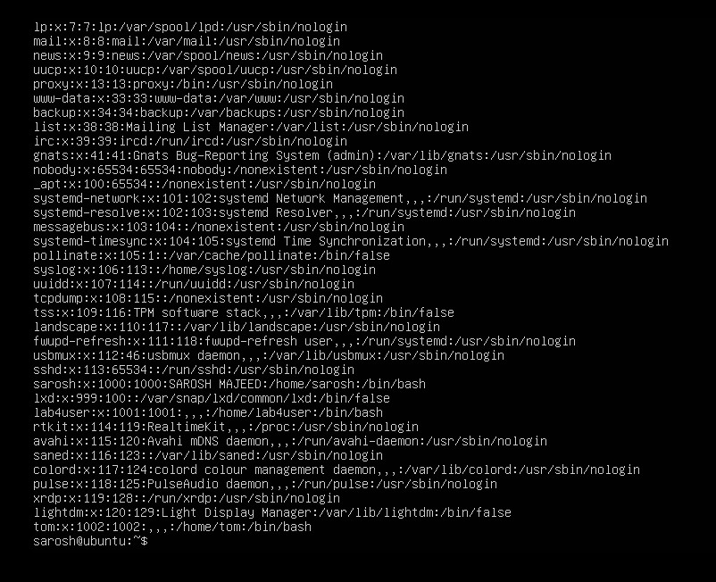

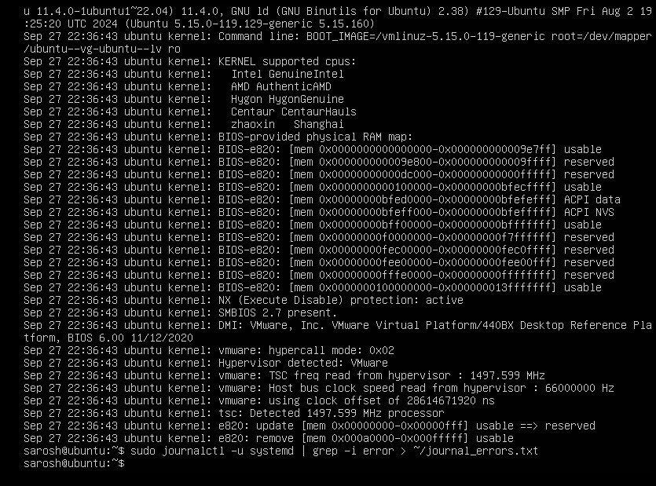

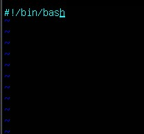
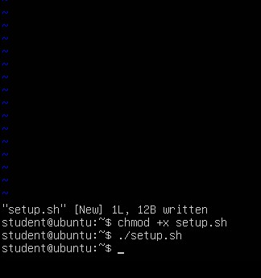

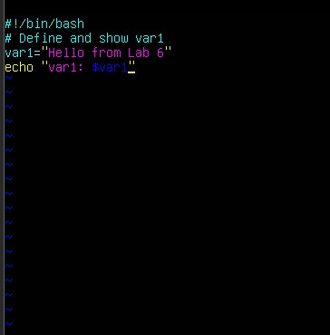

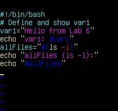

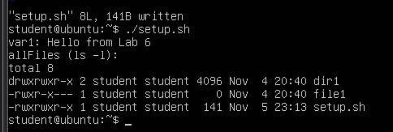
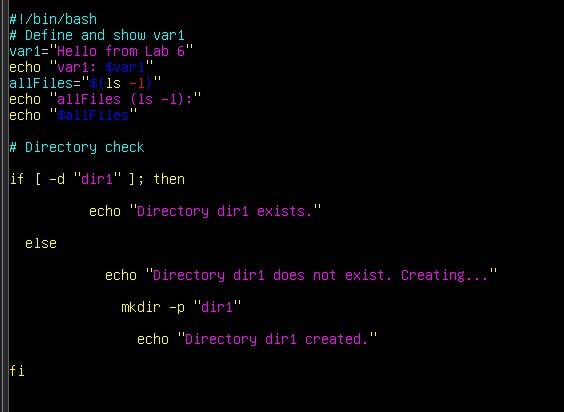

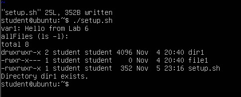

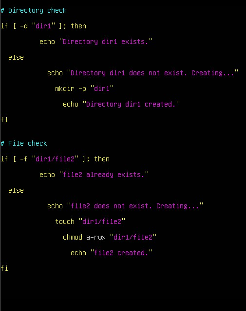
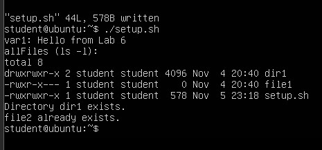

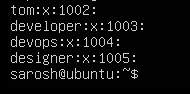

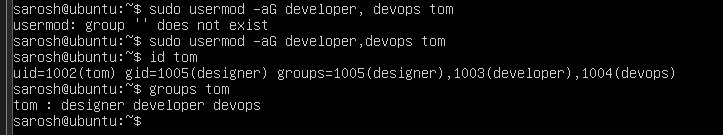

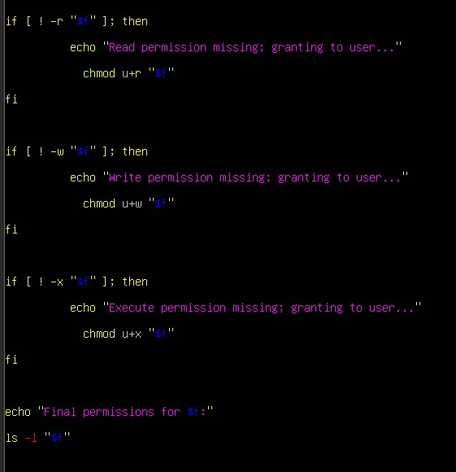

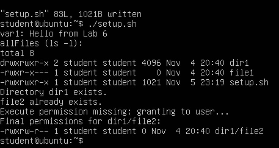

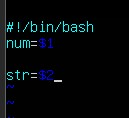
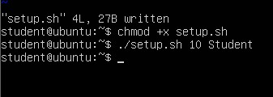

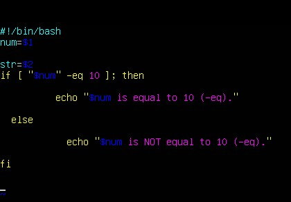

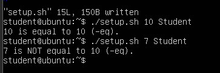
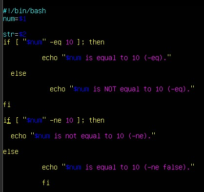
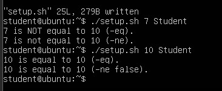

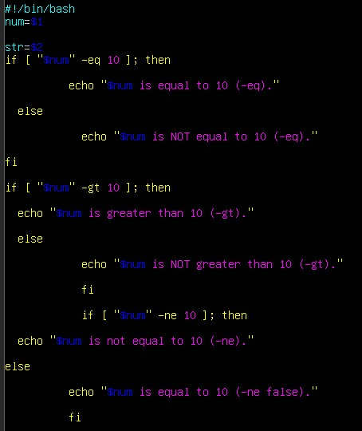

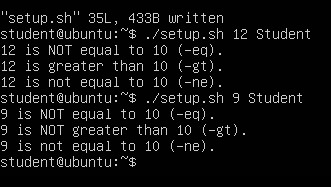

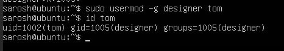

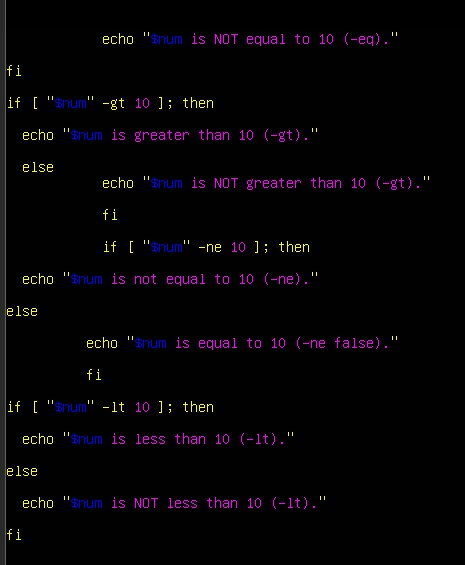

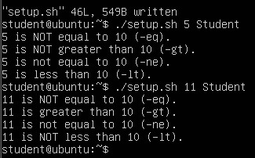

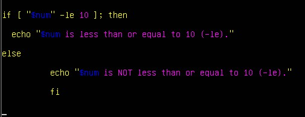

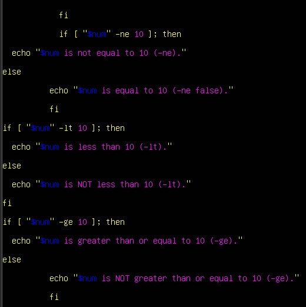
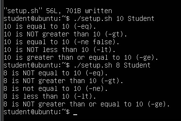

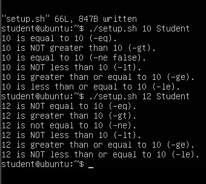

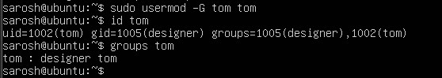

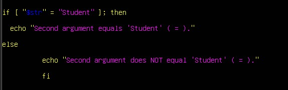

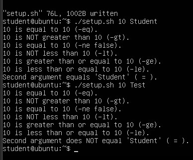

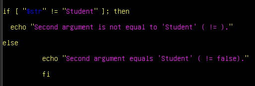

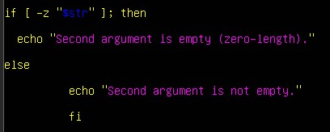

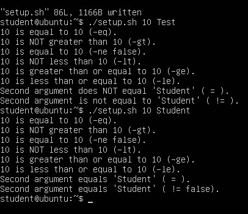

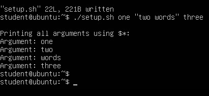

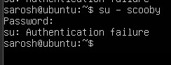

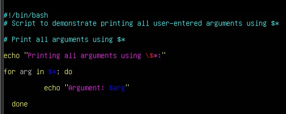

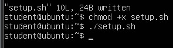

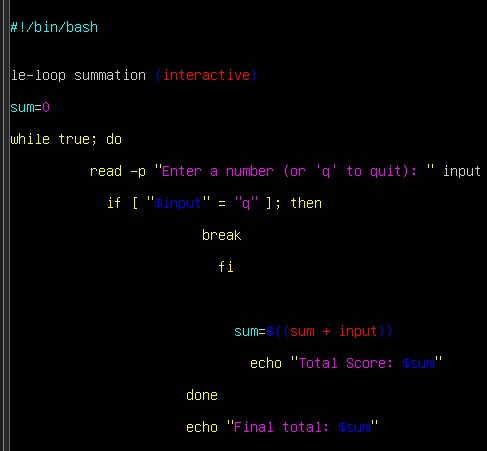

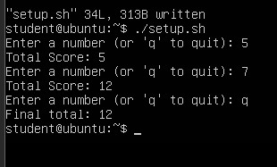

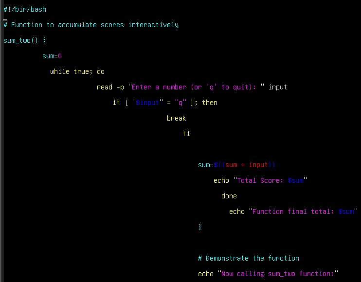

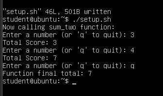

