Fatima Jinnah Women University

> *Department of Software Engineering*
>
>   style="width:1.61597in;height:1.61597in" />
>
> *----------------------------------------------------------------------------------------------------------------------------------------*
>
> <u>LAB \#07</u>
>
> **SUBJECT: CLOUD COMPUTING**
>
> **SUBMITTED TO: SIR MUHAMMAD SHOAIB**
>
> **SUBMITTED BY: UMBER QASIM**
>
> **REGISTRATION NO: 2023-BSE-066**
>
> **CLASS: BSSE V-B**

> 

***<u>Environment Variables, PATH, UFW, and SSH Key
Authentication</u>***

**<u>Task#01:</u> Print & filter environment variables**

***Print all environment variables***

***Filter specific variables***

**<u>Task#02:</u> Export DB\_\* variables temporarily and observe
scope**

***Define (export) variables***

***Echo the variables***

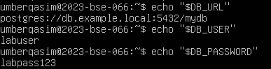

***Filter only DB\_ variables using grep***

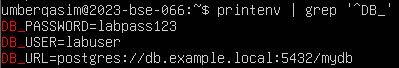

***Close and reopen terminal***

**<u>Task#03:</u> Make DB\_\* variables persistent in ~/.bashrc**

***Open ~/.bashrc and variables***

***Reload (source) and verify***

***Close terminal and reopen***

**<u>Task#04:</u> System-wide environment variable, welcome script, and
PATH**

***View /etc/environment (before editing)***

***Show current PATH***

***Edit /etc/environment and add Class variable***

***Create ~/welcome script and make it executable***

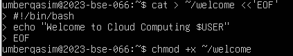

***Run script with ./welcome***

***Add PATH modification line to ~/.bashrc***

***Reload and verify you can run welcome directly***

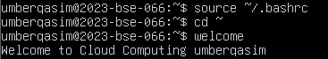

**<u>Task#05:</u> Block and allow SSH using ufw (firewall)**

***Enable UFW and show status***

***Deny SSH (port 22) and check status***

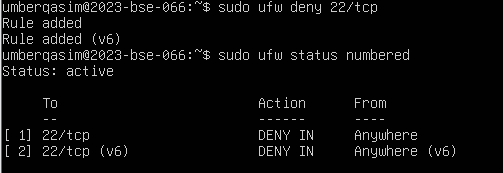

***Attempt SSH from Windows host (should fail)***

***Allow SSH back and reload firewall***

***Attempt SSH again from Windows host (should succeed)***

**<u>Task#06:</u> Configure SSH key-based login from Windows host**

***Generate SSH key pair (ed25519)***

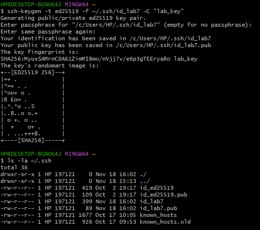

***Show the public key content***

***Clear known_hosts file***

***First SSH connection to server***

***Verify known_hosts updated***

***Prepare ~/.ssh directory & clear authorized_keys***

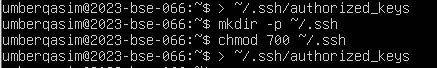

***Add public key & set permissions***

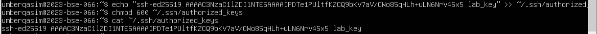

***Test SSH Key-Based Login from Windows host (passwordless)***

**<u>Exam Evaluation Questions</u>**

1.  **<u>Quick Environment Audit</u>**

***Display environment variables***

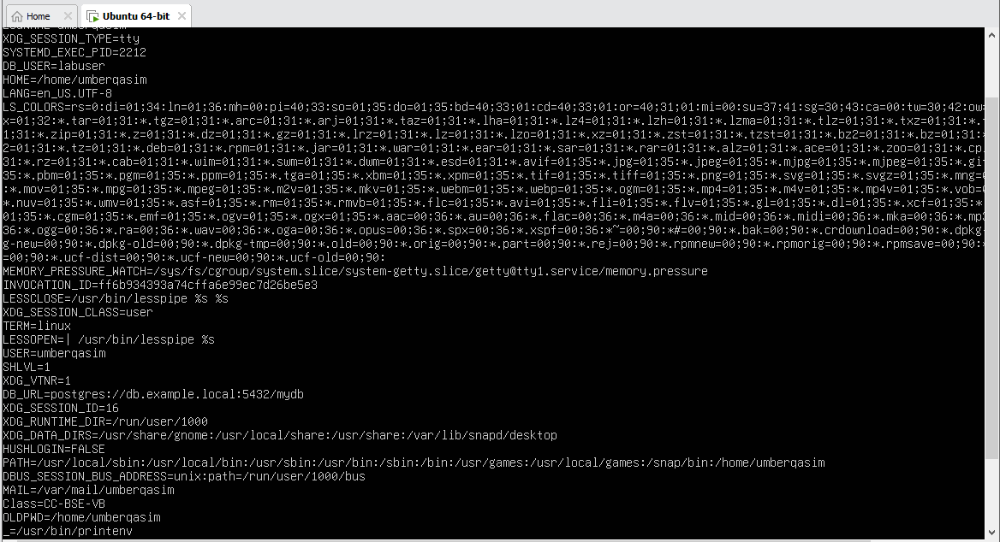

***Showing values for PATH, LANG, and PWD***

2.  **<u>Short-lived Student Info</u>**

***Set three variables (STUDENT_NAME, STUDENT_ROLL_NUMBER,
STUDENT_SEMESTER) using export***

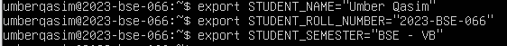

***Print the three values with echo (grouped)***

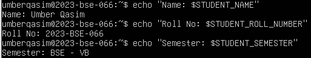

***Single printenv\|grep command to list any STUDENT\_ variable***

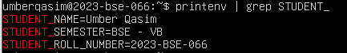

***Open a fresh terminal, and show that the STUDENT\_ variables are not
set (use echo and printenv\|grep together)***

3.  **<u>Make It Sticky (Persistence Check for Student Info)</u>**

***Edit the ~/.bashrc file***

***Reload Config and Verify***

***Persistence*** ***Demonstration***

4.  **<u>Firewall Rules: Block and Restore Ping (ICMP)</u>**

***UFW Enable and Status Check***

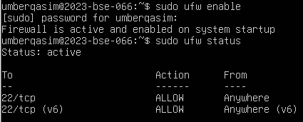

***Ping (ICMP) Block:***

***Ping the server while the rule is active and capture the
blocked/failing:***

***Re-allow ping (ICMP):***

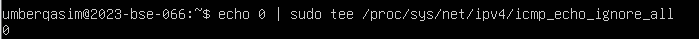

***Capture the allow/reload:***

