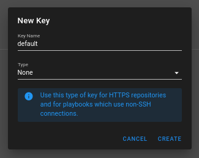
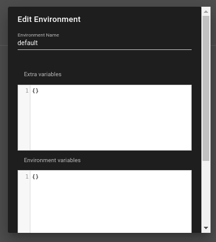
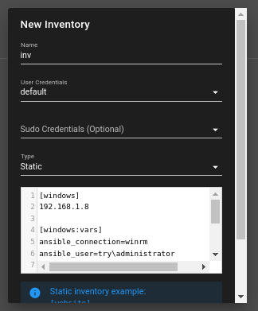
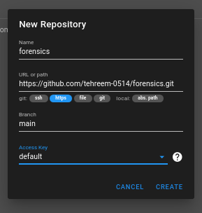
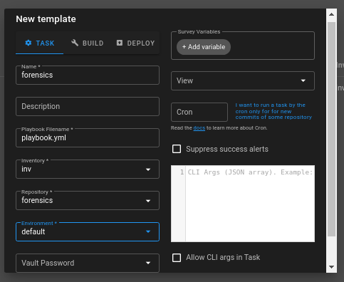

In the **key store**, I created a key with name “default” and type none:
(this key was compulsory for adding repository, inventory and task
template so have no other choice except creating a one with type none)

In **environment**: (this was also compulsory so created a default
one)

In **inventory**:

Pasted the inventory file as it is by keeping type static and using the
default credentials:

In **repositories**, i added the repo link:

<https://github.com/tehreem-0514/forensics.git>

and used the key named “default” i created previously

in task templates, i created a new template named “forensics”, my
playbook name in the repo was playbook.yml so used that, inventory, repo
and environment were selected by the names they were created
previously:

